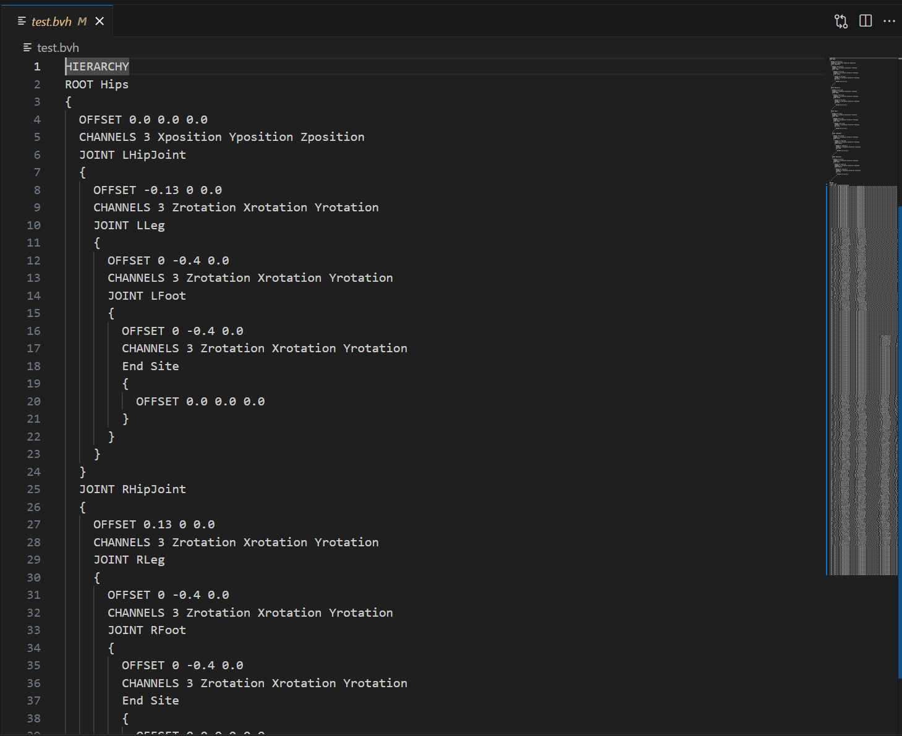

# Body Kinematics
This is a simple demo in Python for 2d human body forward and inverse kinematics. Every joint should only have Y and Z position and X rotation.
Skeleton hierarchy looks like this:
```
Hips
+- LHipJoint
|   +- LLeg
|       +- LFoot
+- RHipJoint
|   +- RLeg
|       +- RFoot
+- Chest
    +- Neck
    |   +- Head
    +- LShoulder
    |   +- LArm
    |       +- LWrist
    +- RShoulder
        +- RArm
            +- RWrist
```
The GUI is implemented with Python tkinter.
# Demos
## Basic Movements

Users can move every joints in the skeleton by clicking and dragging. The skeleton will translate on the screen if the dragging joint is set to be static. Otherwise, the joint will move according to the last static joint. In this process, every child joints will maintain a fixed angle.
If the target position of a joint is not reachable, the limb will point to the target position.
## Pinning

Users can "pin" a joint by right clicking the joint. When the joint is pinned, it will try to remain static in body translation. Pinned joints can still be dragged.
## Recording to .bvh Files

Users can record the movement of the skeleton by clicking "start" button. After stopping recording, the program will automatically generate the record file in .bvh format. The .bvh viewer shown in the animation is BVHView.
The recorded .bvh file will looks like this: 